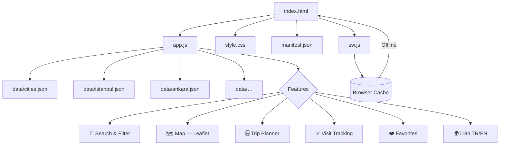
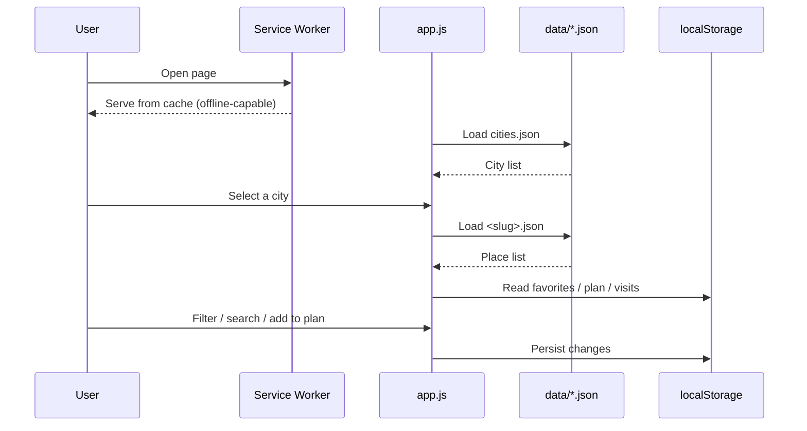

# Seyyah 🧭

> A simple, fast, and fully static travel guide for discovering cities in Turkey.

**No framework · No build step · No server · Pure HTML + CSS + JavaScript**

🔗 **Live site:** [abdullahsahin.org/seyyah](https://abdullahsahin.org/seyyah)

---

## Features

### Discover & Filter
- 🔎 **Cross-city live search** — instant autocomplete with search history
- 🗺️ **Filter by region** — Marmara, Black Sea, Southeast Anatolia… chips
- 🏙️ **City cards** — cover image, description, and place count
- 📂 **Category tabs** — All / Food / Mosque / Museum / Sights
- 🏷️ **Tag filter** — historic, free, scenic, sweets…
- ⏰ **"Open now" filter** — real-time open/closed indicator per place

### Place Details
- 🍽️ **"Must eat:"** — what to order at food places
- 📍 **Directions** — Google Maps link for every place
- ♿ **Accessibility info** — wheelchair access, elevator, accessible toilet, audio guide
- 🌸 **Seasonal calendar** — 12-month best-time-to-visit indicator
- 👍 **"You might also like"** — similar place recommendations by category

### Map & Navigation
- 🗺️ **Embedded map** — Leaflet + OpenStreetMap with category-colored markers
- 🧭 **Nearby places** — sort by distance using geolocation (Haversine formula)
- 🔗 **Deep linking** — shareable URL for every place (`#istanbul/topkapi-sarayi`)

### Planning & Tracking
- 🗒️ **Trip planner** — drag-and-drop ordered place list + Google Maps route export
- ✅ **Visit tracking** — mark places visited with date and personal notes
- 📊 **Travel stats** — collapsible panel showing visited count, favorites, and plan progress
- ❤️ **Favorites** — saved in the browser, shareable via URL

### User Experience
- 🌗 **Dark mode** — follows system preference, user-toggleable
- 🌍 **TR / EN** — full bilingual support
- 📱 **Fully responsive** — mobile, tablet, desktop
- 📲 **PWA support** — installable app, works offline

### SEO & Infrastructure
- 🤖 **Search-engine friendly** — sitemap.xml, robots.txt, Open Graph, hreflang tags
- 💾 **Service worker** — cache-first offline strategy
- 🧠 **LLM-friendly** — llms.txt content summary for AI systems

---

## Architecture



---

## Data Flow



---

## Local Development

The `fetch()` API does not work over the `file://` protocol — start a small local server:

```bash
# Python 3 (usually pre-installed)
python -m http.server 8000
# → http://localhost:8000

# or with Node.js
npx serve
```

---

## Leaflet Map Setup (Optional)

The map feature requires the Leaflet library. Without it the app works perfectly —
the map area simply shows a short info message.

**Steps:**

1. **Download:** https://leafletjs.com/download.html → download and extract the ZIP.
2. **Copy** the following files into `vendor/leaflet/`:

```
vendor/leaflet/
├── leaflet.js
├── leaflet.css
└── images/
    ├── marker-icon.png
    ├── marker-icon-2x.png
    └── marker-shadow.png
```

3. Restart the local server. The map will now appear.

---

## Deploying to GitHub Pages

1. Push the project to GitHub as a **public** repo (repo name: `seyyah`).
2. Go to **Settings → Pages**.
3. **Source:** `Deploy from a branch` → branch: `main`, folder: `/ (root)` → **Save**.
4. After a few minutes the site is live at:

```
https://<your-username>.github.io/seyyah/
```

> ⚠️ All file paths are relative (`data/cities.json`). Absolute paths starting
> with `/` will break in a GitHub Pages subdirectory.

---

## Updating the Sitemap

After adding a new city or place, regenerate the sitemap:

```bash
node generate-sitemap.js
```

The script reads all JSON files in `data/` and writes an updated `sitemap.xml`.

---

## Adding a New City or Place

**New city:**
1. Create `data/<slug>.json` following the `istanbul.json` schema.
2. Add the new entry to `data/cities.json`.
3. Run `node generate-sitemap.js` to update the sitemap.

**New place:**
- Add a new object to the `places` array in the relevant city file. No code changes needed.

### City JSON Structure

```json
{
  "city": "Istanbul",
  "slug": "istanbul",
  "region": "Marmara",
  "description": "Capital of 2700 years of history bridging two continents.",
  "seasons": [
    { "month": 1, "rating": "ok",   "note": "Cold but quiet" },
    { "month": 4, "rating": "good", "note": "Spring is the golden season" }
  ],
  "places": [ ... ]
}
```

### Place Fields

| Field | Type | Required | Description |
|-------|------|:--------:|-------------|
| `name` | string | ✓ | Place name |
| `category` | string | ✓ | `yemek` / `cami` / `muze` / `gezi` |
| `description` | string | ✓ | Short description |
| `tags` | string[] | — | Tags (free, historic, scenic, sweets…) |
| `mustEat` | string[] | — | Food places only: what to order |
| `priceLevel` | 1–3 | — | Price level (number of ₺ symbols) |
| `openHours` | string | — | Opening hours |
| `location` | `{ lat, lng }` | — | For Google Maps directions and the map |
| `accessibility` | object | — | `{ wheelchair, elevator, accessibleToilet, audioGuide }` |

### Season Ratings

| Value | Meaning |
|-------|---------|
| `"good"` | Ideal time to visit |
| `"ok"` | Acceptable, some caveats |
| `"avoid"` | Not recommended for this month |

---

## File Structure

```
seyyah/
├── index.html              ← single entry point (includes SEO meta tags)
├── style.css               ← all styles + light/dark themes
├── app.js                  ← SPA logic, i18n, router, all features
├── sw.js                   ← service worker (PWA / offline support)
├── manifest.json           ← PWA manifest (installable app)
├── robots.txt              ← search engine and LLM bot directives
├── sitemap.xml             ← XML sitemap covering all URLs
├── generate-sitemap.js     ← script to auto-generate sitemap.xml
├── llms.txt                ← content summary for AI systems
├── package.json            ← npm sitemap script
│
├── data/
│   ├── cities.json         ← master city list (slug, region, description)
│   ├── istanbul.json       ← Istanbul places + seasons
│   ├── ankara.json
│   ├── izmir.json
│   ├── konya.json
│   ├── trabzon.json
│   └── gaziantep.json
│
├── icons/
│   ├── icon-192.svg        ← PWA icon (192×192)
│   └── icon-512.svg        ← PWA icon (512×512)
│
├── docs/
│   ├── seyyah.md           ← LLM-friendly site documentation
│   └── design.md           ← design system notes
│
└── vendor/
    └── leaflet/            ← manually downloaded (see above)
        ├── leaflet.js
        ├── leaflet.css
        └── images/
```

---

*Seyyah — before you hit the road.* 🧭
